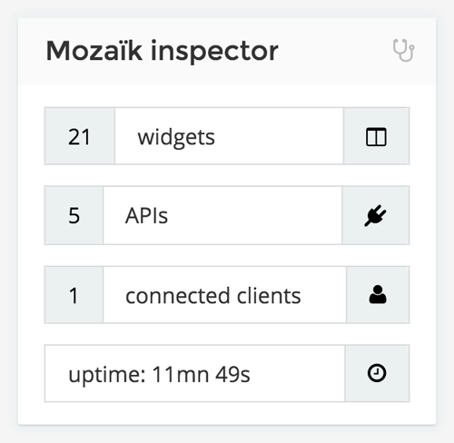

Mozaïk 1.2.0 was released, some internals changes and a brand new widget!

So there's now a new `mozaik.inspector` widget:



To use it:

```javascript
{
    type: 'mozaik.inspector',
    columns: 1, rows: 1,
    x: 0, y: 0
}
```

You can check detail on [GitHub](https://github.com/plouc/mozaik/releases/tag/v1.2.0).
